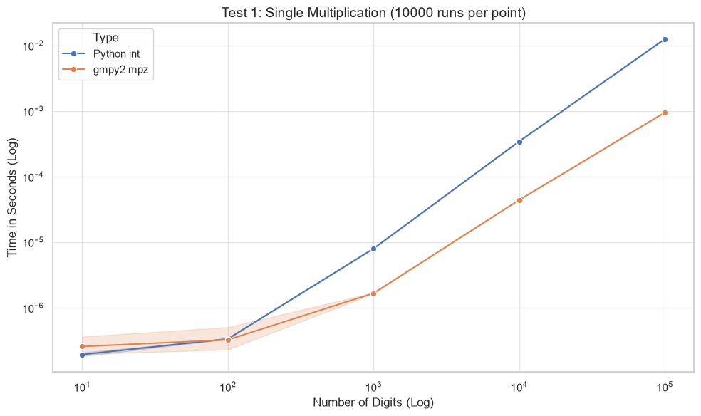
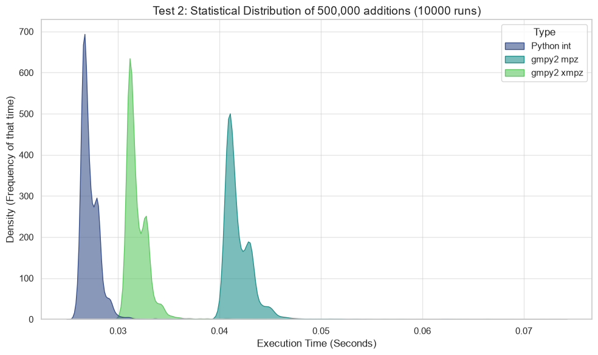
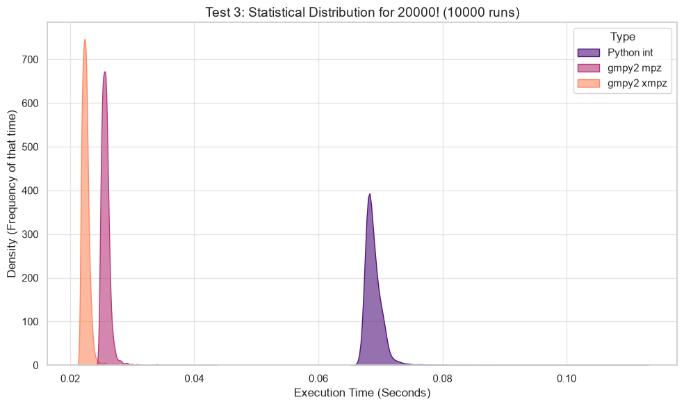

<div align="center">

# Benchmark per numeri grandi: int di Python vs gmpy2 (mpz, xmpz)

[](README.md)


</div>

## Panoramica

Questo archivio contiene un benchmark prestazionale completo che confronta gli interi a precisione arbitraria nativi di Python (`int`) con la libreria GNU Multiple Precision Arithmetic (GMP), interfacciata tramite il modulo `gmpy2`.

L'obiettivo è stabilire con precisione quando e come utilizzare `gmpy2` in computazioni matematiche su larga scala, valutando nello specifico le differenze tra:
*   **Python int**: Nativo, immutabile.
*   **gmpy2 mpz**: Ottimizzato in C, immutabile.
*   **gmpy2 xmpz**: Ottimizzato in C, mutabile (permette la modifica della memoria in-place).

## Metodologia

Per garantire l'affidabilità statistica ed eliminare le interferenze dei processi in background del sistema operativo, ogni singolo punto dati di questo benchmark è il risultato di 10.000 esecuzioni indipendenti. I tempi di esecuzione sono stati misurati tramite `time.perf_counter()` e visualizzati utilizzando la stima della densità di kernel (KDE) per illustrare la distribuzione e la stabilità dei risultati.

## Risultati

### 1. Punto di Incrocio su Singola Operazione
Verifica il tempo di esecuzione della moltiplicazione di due numeri con un numero di cifre crescente (da 10 a 100.000 cifre).



**Conclusione:** Python nativo è più veloce per numeri inferiori a 100 cifre a causa del sovraccarico di comunicazione (overhead) della C-API. Per numeri che superano le 1.000 cifre, l'uso di `gmpy2` diventa strettamente necessario per ottenere prestazioni ottimali.

### 2. Accumulo e Stress della Memoria
Verifica un ciclo `for` standard che esegue 500.000 addizioni semplici (`+= 1`) partendo da zero.



**Conclusione:** Per cicli semplici in cui i valori numerici rimangono relativamente contenuti, la gestione nativa degli interi di Python supera in efficacia `gmpy2`. Tra i tipi di dato GMP, la variante mutabile `xmpz` offre prestazioni nettamente superiori rispetto a `mpz` poiché evita la riallocazione continua degli oggetti in memoria.

### 3. Scalabilità Algoritmica (Fattoriale Iterativo)
Verifica il calcolo di 20000! attraverso un ciclo di moltiplicazione iterativo, simulando carichi di lavoro algoritmici intensivi in cui sia il numero di iterazioni sia la dimensione delle variabili crescono drasticamente.



**Conclusione:** `gmpy2 xmpz` si attesta come la struttura dati ottimale per operazioni matematiche sequenziali massive. Coniuga gli algoritmi di moltiplicazione in C altamente ottimizzati con mutazioni di memoria in-place, superando ampiamente sia `mpz` sia il tipo `int` nativo di Python.

## Requisiti

**(Windows / macOS / Linux)** Eseguire in un terminale:
```bash
pip install -r requirements.txt
```

Il comando installerà le seguenti librerie, oltre alle loro dipendenze
*   `gmpy2`
*   `pandas`
*   `seaborn`
*   `matplotlib`

## Licenza

Il codice sorgente di questo progetto è rilasciato sotto licenza MIT - Consultare il file [LICENSE](LICENSE) per i dettagli completi.